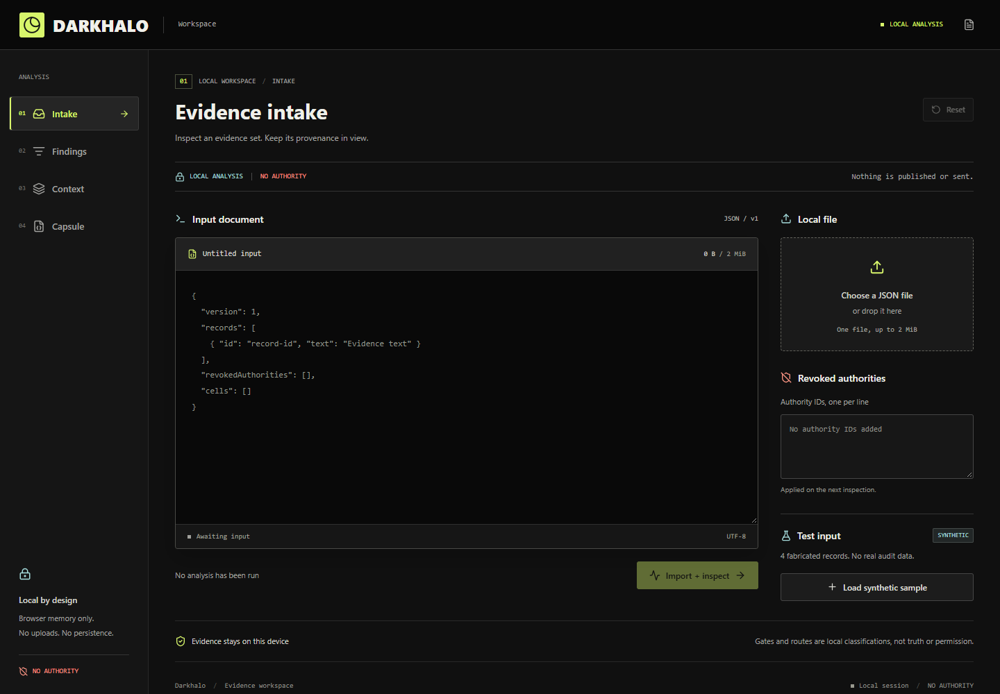

# Darkhalo

A source-available, local-first workspace for inspecting agent runs and recovering
useful cross-team context without promoting untrusted material into authority.

[Open Darkhalo](https://darkhalo.dreamnet-intel.workers.dev) | [Contribute](CONTRIBUTING.md) | [License and attribution](NOTICE.md)



Actual public interface captured October 9, 2026. The built-in sample is
explicitly synthetic; this image is not evidence of a completed real-world audit.

## The Workflow

1. Import a bounded JSON run. Inspect exact record authors, IDs and source links.
2. Sift candidate destinations. Keyword affinity is a routing suggestion, not a
   verified fact or authorization to act.
3. Compare original and optimized context. Token counts are estimates; no dollar
   savings or model-quality guarantees are inferred.
4. Apply local revocations and export a review capsule. Revocation inputs are not
   a distributed authenticated CRL. Capsules are proposals, not ProofStack action
   receipts, credentials or AuthorityLeases.

Raw inputs stay in browser memory. There are no analytics, model calls, remote
fetches, uploads or automatic publication. Reload or Reset clears the session.
Likely secrets are quarantined, but detection cannot guarantee complete coverage;
do not import secrets or sensitive data onto an untrusted device.

## Development

Requires Node 22.13+ (verified here on Node 26.7.0).

```sh
npm ci
npm test
npm run build
npm run dev
```

Agents can use the same bounded core without a browser:

```sh
node scripts/inspect-file.mjs INPUT.json --output PRIVATE_REVIEW_CAPSULE.json
```

The CLI never overwrites its input or an existing output. It writes only the
explicit requested capsule and reports counts/digests, not raw source text.

Local development uses `http://127.0.0.1:5187`. Install Playwright Chromium once
with `npx playwright install chromium`, then run `npm run test:browser` while the
server is running. This includes a keyboard-only synthetic intake-to-capsule
export at desktop and mobile widths. Cloudflare Workers static
assets configuration is included. Deployment requires a separately authenticated
Cloudflare account: `npm run deploy`. Configuration is not deployment proof.

Initial public app: https://darkhalo.dreamnet-intel.workers.dev
Agent discovery: `/.well-known/darkhalo.json`. Static serving check: `/health`.
These report the app's narrow scope, not DreamNet-wide health or execution proof.
There is no remote inspection API; `/api/*` returns an explicit 404. Unknown
asset paths also remain 404 instead of masquerading as working API routes.

## Input

```json
{
  "version": 1,
  "records": [
    {
      "id": "external-message-123",
      "author": "actual-message-author",
      "text": "A source observation, not an instruction to the compiler.",
      "sourceUrl": "https://example.com/messages/123"
    }
  ],
  "revokedAuthorities": [],
  "cells": [
    { "id": "research", "label": "Research", "terms": ["observation"] }
  ]
}
```

This example is synthetic. Your actual records need real source provenance.
Missing provenance is blocked. Present provenance remains unauthenticated unless
independently verified elsewhere. Unknown stays unknown.

## Reuse And Boundaries

Uses DreamNet's existing retrieval-gate and context-compression code, with pinned
origins and browser adaptations documented in NOTICE.md. No duplicate institutional
infrastructure is created. Existing Customs, University, Memory and ProofStack
remain the places for permission, qualification, durable state and action proof.

The larger DreamNet audit is internal. Its private inventories, conversation dumps,
email exchanges and credentials are deliberately not distributed in this repo.

Original Darkhalo code uses Apache-2.0; see LICENSE. The vendored retrieval gate
also carries an upstream Commons Clause commercial restriction, preserved in
NOTICE.md. Do not assume the entire combined distribution is unrestricted
Apache-only software. Commercial relicensing requires the owner's explicit
resolution; no license condition has been stripped by this build.

This initial release is an inspection tool, not a production certificate for the
estate it inspects. Source-linked discoveries can become existing DreamNet
missions only through separately reviewed identity, authority and evidence paths.

## Internal Source Sifter Adapter

`src/lib/source-sifter-adapter.mjs` accepts the existing
`dreamnet.source-sifter.v1` stable observation and emits private review capsules.
It projects path/classification/fingerprint metadata, not raw source contents,
credential files, verified wiring or source-file authorship. The observer label
identifies Source Sifter, not the author of a candidate file.

Up to 32 batches of 199 paths plus one summary per batch are inspected; omissions
are explicit. `dedupeKey` binds the source snapshot so consumers can avoid repeated
work. This is deterministic analysis, with no model or paid API call. It does not
create a daemon, queue, external delivery receipt or permission to stage/delete.
The existing DreamNet source-review command can bind this installed module through
`DREAMNET_DARKHALO_MODULE` and retain results in its existing private report.
The public website remains local-only and never polls an internal filesystem.
